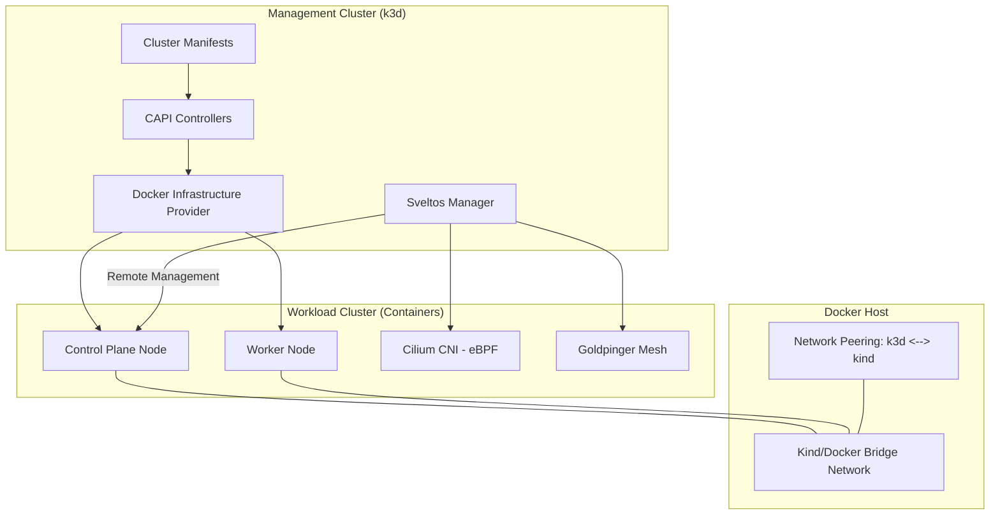

# Build Your Own Kubernetes-as-a-Service (KaaS) Lab

Welcome to the secret kitchen of Cloud Providers! This lab is designed to pull back the curtain on how Hyperscalers automate the creation and management of thousands of Kubernetes clusters.

By combining **Cluster API (CAPI)**, **Sveltos**, and **Cilium**, you are building a full-blown **Kubernetes-as-a-Service** platform on your local machine. You won't just learn how to use Kubernetes; you will learn how to **provide** it as a service, automated from infrastructure to networking.

---

## Architecture & Stack



### 1. Management Cluster (k3d)
A lightweight k3s cluster running in Docker. It acts as the **Control Plane of the Control Planes**, hosting all the operators and controllers.

### 2. Cluster API (CAPI) & CAPD
*   **Cluster API:** Extends Kubernetes with Custom Resource Definitions (CRDs) to manage clusters as objects.
*   **CAPD (CAPI Provider Docker):** The infrastructure provider that translates CAPI `Machine` objects into Docker containers. It uses specialized `kind` node images that run a full `systemd` init system inside the container.

### 3. Project Sveltos
A powerful add-on manager for Kubernetes. In this lab, Sveltos is configured in **Centralized Mode**: agents run on the management cluster and remotely manage the workload clusters. It uses a **Label-based selector** to automatically target new clusters.

### 4. Cilium & Hubble
*   **Cilium:** A CNI (Container Network Interface) powered by eBPF. It replaces traditional `iptables` for faster and more secure networking.
*   **Hubble:** Provides deep observability of network flows at Layer 3, 4, and 7.

---

## Deep Dive: Technical Prerequisites

### The Inotify Challenge (Systemd-in-Docker)
When running Kubernetes inside Docker (CAPD/Kind), each node is a container running a full `systemd` init process.
*   **Problem:** `systemd`, `kubelet`, and `containerd` use **inotify** (a Linux kernel subsystem) to monitor file system events. Since all nodes share the host's kernel, the default limits (usually 128 instances) are quickly exhausted, causing workers to crash with `Too many open files`.
*   **Solution:** We increase `max_user_instances` (number of monitoring programs) and `max_user_watches` (number of files watched) on the host.

```bash
sudo sysctl fs.inotify.max_user_instances=512
sudo sysctl fs.inotify.max_user_watches=524288
```

### Docker Networking & Communication
This lab involves two distinct Docker networks:
1.  **k3d network:** Where the management cluster lives.
2.  **kind network:** Where the workload clusters are created by CAPD.
By default, these networks are isolated. Our bootstrap script performs a **Network Peering** by connecting the k3d management node to the `kind` network. This allows the CAPI and Sveltos controllers to reach the API Server of the workload clusters at their internal Docker IP.

---

## Getting Started: Step-by-Step

### 1. Initialize the Management Cluster
```bash
./bootstrap/01-init-management-cluster.sh
```
**What happens technically?**
*   **k3d Cluster Creation:** Spins up the management node.
*   **CAPD Initialization:** Runs `clusterctl init`, which deploys the CAPI core controllers and the Docker infrastructure provider.
*   **Networking:** Creates the `kind` bridge network and attaches the management node to it.

### 2. Install Sveltos & Policies
```bash
./bootstrap/02-install-sveltos.sh
```
**What happens technically?**
*   **Operator Deployment:** Installs Sveltos controllers in the `projectsveltos` namespace.
*   **ClusterProfiles:** Registers the `install-cilium` and `install-goldpinger` profiles. These are **blueprints** that tell Sveltos: *"If you see a cluster with the label cni=cilium, deploy this Helm chart"*.

### 3. Deploy a Workload Cluster
```bash
kubectl apply -f clusters/workload-01.yaml --kubeconfig ./capi-management.kubeconfig
```
**What happens technically?**
1.  **CAPI Reconciliation:** The CAPI controllers see the new `Cluster` and `DockerMachine` objects.
2.  **Infrastructure Provisioning:** CAPD starts Docker containers for the Control Plane and Workers.
3.  **Kubeadm Bootstrapping:** Inside the containers, `kubeadm` is executed to initialize the Kubernetes cluster.
4.  **Sveltos Detection:** Sveltos detects the new cluster via CAPI events, matches the labels, and starts pushing Cilium and Goldpinger.

---

## 🔍 Visualization Tools

### Goldpinger UI (Connectivity Matrix)
```bash
kubectl port-forward -n kube-system ds/goldpinger 8080:8080 --kubeconfig ./workload-01.kubeconfig
```
Access [http://localhost:8080](http://localhost:8080) to see the real-time mesh connectivity between all nodes.

### Hubble UI (Network Observability)
```bash
kubectl port-forward -n kube-system svc/hubble-ui 12000:80 --kubeconfig ./workload-01.kubeconfig
```
Access [http://localhost:12000](http://localhost:12000) to inspect Layer 7 traffic and network policies.

---

## Cleanup
```bash
./bootstrap/00-cleanup.sh
```
Removes all workload containers (via Docker labels), deletes the `kind` network, and destroys the k3d cluster.
